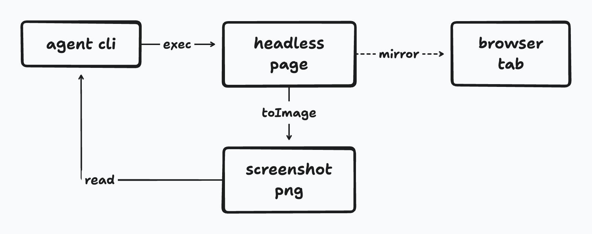

# tldrawkc

Draw a diagram on a real [tldraw](https://tldraw.dev) canvas from the command
line, take a picture of it, look, and fix it. Built for coding agents, which
write code well and read images well but cannot see what they just drew unless
something renders it.

**Status: phase 2.** `new`, `run`, `shot`, `inspect`, `export`, `from-mermaid`,
`api` and `doctor` work. The human view (`serve`) is specified and not written
yet; `tldrawkc help` lists which phase brings it.

## What it draws

The example snippet from the helper reference, run end to end and screenshotted
by the tool itself:



```js
helpers.box('agent', 'agent cli', { x: 60, y: 60, w: 170, h: 64 })
helpers.box('page', 'headless page', { after: 'agent', gap: 120, w: 190, h: 64 })
helpers.box('png', 'screenshot png', { below: 'page', gap: 90, w: 190, h: 64 })
helpers.box('tab', 'browser tab', { after: 'page', gap: 140, w: 170, h: 64 })

helpers.connect('agent', 'page', { label: 'exec' })
helpers.connect('page', 'png', { label: 'toImage' })
helpers.connect('png', 'agent', { label: 'read', start: 'left', end: 'bottom' })
helpers.connect('page', 'tab', { label: 'mirror', dash: 'dashed' })

return helpers.getLints()
```

```bash
tldrawkc run loop.tldr --code loop.js --shot loop.png --create
```

Every arrow is bound at both ends, so moving a box drags its arrows with it.
The labels are tldraw's own Shantell Sans, bundled into the page so nothing
is fetched at render time.

## From mermaid

Most diagrams that already exist are mermaid, so `from-mermaid` lifts one onto
the canvas and leaves it editable. This is `test/fixtures/mermaid/subgraph-8-9.mmd`,
8 nodes, 9 edges and a subgraph, run through the command and screenshotted by
the tool:

```
flowchart TD
  agent[agent cli] --> cli[tldrawkc]
  cli --> browser[chromium]
  browser --> page[tldraw page]
  subgraph render [rendering]
    page --> shapes[shapes and arrows]
    shapes --> png[png export]
    shapes --> svg[svg export]
  end
  png --> look{Looks right?}
  svg --> look
  look -->|no| cli
```

```bash
tldrawkc from-mermaid eight.tldr --source subgraph-8-9.mmd --shot eight.png
```


Every edge is a bound arrow, the subgraph is a labelled container behind its
shapes, and the back edge is an arc routed around the column rather than a
straight line through six boxes. Anything the parser cannot read is listed
under `unsupported` instead of being dropped: mermaid's `classDef` and `class`
styling lines are the usual ones.

## The loop

One Node program and one browser page. Every command launches headless
Chromium, loads a `.tldr` file into a live tldraw editor, runs a JavaScript
snippet against it with a `helpers` bag in scope, saves the file, and
optionally writes a PNG or an SVG. The agent reads the PNG with its own image
tooling and sends the next snippet. A lint pass flags the things that go wrong
with generated diagrams, overlapping shapes, arrows pointing at nothing and
arrows drawn through boxes they have nothing to do with, and makes them a
non-zero exit code so nobody declares the drawing finished without looking. There is no daemon, no sync server, and no React in
the dependency tree of whatever repo installs this.

## Install

Needs Node 22 or newer and a Chromium. Most machines already have Google
Chrome, which is enough.

```bash
git clone https://github.com/c-wenlong/tldrawkc.git
cd tldrawkc
npm ci
npm run build
node dist/cli/index.js doctor
```

`doctor` prints one line per check and tells you which browser it picked. If
it cannot find one, either pass `--chromium <path>`, set `TLDRAWKC_CHROMIUM`,
or run `npx playwright install chromium`.

As a git submodule, which is how [self-learn](https://github.com/c-wenlong/self-learn)
uses it:

```bash
git submodule update --init tldrawkc
(cd tldrawkc && npm ci && npm run build)
npm run canvas -- doctor
```

## Commands

```bash
tldrawkc new diagram.tldr                 # an empty document, refuses to overwrite
tldrawkc run diagram.tldr --code draw.js --create --shot out.png
tldrawkc shot diagram.tldr                # a PNG in the temp directory, path printed
tldrawkc inspect diagram.tldr             # every shape, binding and lint. Exits 3 on lints
tldrawkc export diagram.tldr --svg out.svg --png out.png
tldrawkc from-mermaid map.tldr --source map.mmd
tldrawkc api                              # what a snippet can call
tldrawkc doctor                           # node, the bundle, Chromium, the page, fonts, write access
```

`run` is the verb that matters. It loads the file, runs your snippet with
`editor`, `helpers` and `tldraw` in scope, saves, and then exports. `--code -`
reads the snippet from stdin, so an agent can heredoc one without leaving a
file behind:

```bash
tldrawkc run loop.tldr --create --shot /tmp/loop.png --code - <<'JS'
helpers.box('agent', 'agent cli', { x: 60, y: 60, w: 170, h: 64 })
helpers.box('page', 'headless page', { after: 'agent', gap: 120 })
helpers.connect('agent', 'page', { label: 'exec' })
return helpers.getLints()
JS
```

Add `--json` to any command for one machine-readable object on stdout.

### Reading, exporting, importing

`inspect` is how an agent looks before it edits: one line per shape with its
geo, position, size and label, then the bindings, then the lints. With `--json`
it prints the bridge's own structure, so the same object backs the printed view
and any other consumer.

`export` writes the files that get committed: a self-contained SVG with the
fonts inlined, a PNG, or both. Nothing is executed and nothing is saved, so the
`.tldr` cannot be damaged by an export.

`from-mermaid` lifts an existing flowchart onto the canvas, which is the point
of the whole tool for a repo whose diagrams are all mermaid today:

```bash
tldrawkc from-mermaid map.tldr --source learn/map.mmd --shot /tmp/map.png
```

Without `--append` the document must not already exist, so a canvas someone has
since fixed by hand is never overwritten. Any line the parser cannot read is
reported, in the result and on stderr, and never silently dropped.

### The lint pass

`run`, `inspect` and `from-mermaid` all report it, and a non-empty list is exit
code 3. Seven rules:

| Rule | Fires when |
| --- | --- |
| `friendless-arrow` | An arrow has no binding at one or both ends |
| `arrow-crosses-shape` | An arrow's rendered path runs through a geo or note shape that is neither of the two it connects |
| `overlapping-text` | Two text-bearing shapes' label boxes intersect |
| `overlapping-shapes` | Two shapes intersect by more than a tenth of the smaller one's area |
| `off-page` | A shape sits further than 10000 page units from the origin |
| `empty-label` | A geo shape has no text and no fill, so it renders as an unexplained outline |
| `unreadable-label` | The widest unbreakable run of a label is wider than the room the shape gives it |

`meta.lintIgnore` on a shape mutes a rule for it: an array of rule names, or
`true` for all of them. `helpers.stub` sets it, which is the only reason a
decorative line pointing at nothing survives the pass. A container drawn by
`helpers.boxShapes` carries `meta.container` and is exempt from
`overlapping-shapes`, `empty-label` and `arrow-crosses-shape`, because covering
its members and being crossed by arrows is what a container is for.

`arrow-crosses-shape` reads tldraw's own geometry on both sides, so an elbow
route is tested leg by leg, an arc as the polyline tldraw samples it into, and a
diamond as a diamond rather than as the page box whose four corners it leaves
empty. A shape counts as crossed only once the line is more than 4 page units
inside its outline, which is about the combined width of the two strokes: an
arrow that touches a box is two lines meeting, not a line disappearing behind
one. A concave geo (`star`, `cloud`, `heart`) is walked by sampling rather than
eroded, so an arrow threaded through a star's notch stays quiet.

### The helper reference

`tldrawkc api` prints what a snippet can call, generated from the helpers' own
JSDoc so the docs and the code cannot drift. `npm run build` regenerates
`dist/api.json` as part of the build.

The convention, which the page side has to keep to for a helper to appear:

- a `/** ... */` block sits **directly** above the declaration, with no blank
  line between them
- the declaration is a named function (`function name(`, optionally `export`
  and `async`, at any indentation) or an interface method signature
- the block carries an `@example`, because the point of the reference is a line
  an agent can copy

The first paragraph becomes the summary, `@param` lines are kept, and the
signature is the parameters as written.

### Exit codes

| Code | Meaning |
| --- | --- |
| 0 | Done, no lints |
| 1 | Bad arguments, a missing file, or the environment (no Chromium, the page never answered, the snippet ran past `--timeout`) |
| 2 | The snippet threw. The document is untouched. |
| 3 | Saved, but lints remain. Read them and run again, or pass `--allow-lints`. |
| 4 | The export failed after a successful save. The `.tldr` is safe; run `shot` again. |

3 is deliberate. The work is real, so it is written, and the non-zero code is
what stops an agent calling a diagram finished without looking at it.

## Design

The brief this is built from lives in the self-learn repo under
[tldraw-integration/](https://github.com/c-wenlong/self-learn/tree/main/tldraw-integration):
the decisions already made, the architecture, the full CLI reference, the
helper vocabulary, and the phase roadmap. [AGENTS.md](AGENTS.md) is the
operating manual for working in this repo.

## Licence

MIT. See [LICENSE](LICENSE).
