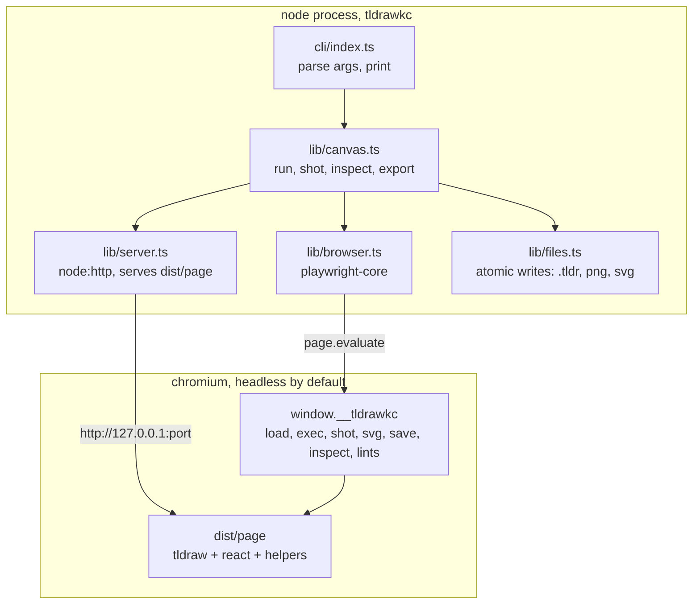
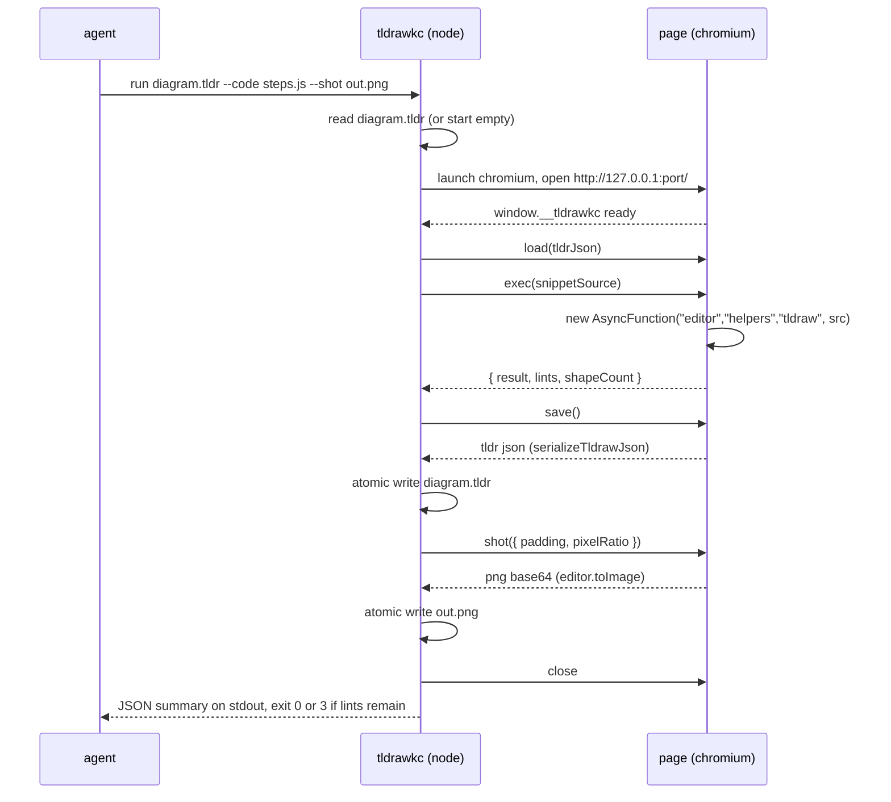

# Architecture

`tldrawkc` is a command line tool that lets a coding agent draw a diagram on
a real tldraw canvas, take a picture of it, look, and fix it. It is one Node
program and one browser page. The page owns every drawing decision; the Node
side only launches the page, moves files, and prints.

## The shape



| Layer | Where | What |
| --- | --- | --- |
| Entry points | `src/cli/` | Argument parsing and printing. The only module that prints. |
| Orchestration | `src/lib/` | Launches Chromium, serves the page, calls the bridge, writes files. Takes data, returns data. `list` and `meta set` are the two verbs that never open a browser at all (see "Document metadata" below), and `serve` is the third, for the opposite reason: it wants the human's own browser rather than a headless one this process owns. |
| Drawing | `src/page/` | A Vite app: `<Tldraw>`, the `helpers` bag, the mermaid importer, the lint pass, the mirror view, and the `window.__tldrawkc` bridge. Built into `dist/page/`. |
| Optional entry | `src/mcp/` | Deferred. A thin wrapper over `src/lib/` exposing the same verbs as MCP tools. See [DECISIONS.md](DECISIONS.md). |

**The version, as built (phase 0):** tldraw is on **5.4.2**, not the 4.x
these docs were written against. Every API the design depends on is present in
v5: `markHistoryStoppingPoint`, `bailToMark`, `toImage`, `getSvgString`,
`serializeTldrawJson`, `parseTldrawJsonFile`, `loadSnapshot`, `onMount`,
`hideUi` and `zoomToBounds`. Nothing in this document had to change for it.
Do not trust a 4.x changelog entry without checking the installed `.d.mts`.

Nothing in `src/lib/` or `src/cli/` imports `tldraw`, `react` or anything
from `src/page/`. Those packages exist only inside the page bundle, which is
why the tool can be dropped into any repo without adding React to its
dependency tree.

## The layout

```
tldrawkc/
  package.json            name, "type": "module", bin, exports, engines node >=22
  bin/tldrawkc            shell shim: node "$(dirname "$0")/../dist/cli/index.js" "$@"
  src/
    cli/
      index.ts            dispatch, --json, exit codes. The only module that prints
      args.ts             parseCommand(argv, env), pure: no printing, no exiting, no throwing
    lib/
      index.ts            public API re-exports (openCanvas, runSnippet, ...)
      canvas.ts           one function per verb that needs a browser: run, shot, newDocument, inspect, exportCanvas, fromMermaid
      serve.ts            serve: the page on a fixed port plus the machine's own browser, as a handle the caller closes
      meta.ts             the document metadata: shape, .tldr JSON surgery, meta set, the SVG stamp. No browser
      list.ts             list: a directory of .tldr files as data. No browser
      fonts.ts            the SVG font subsetter: which characters a document draws, and the @font-face surgery
      font-coverage.ts    which glyphs each bundled woff2 has, read out of its own cmap
      api.ts              the helper reference: a parser over the page's JSDoc, and the build step behind dist/api.json
      errors.ts           the failures the tool raises on purpose, each carrying its exit code
      browser.ts          launch or connect Chromium, open the page, wait for the bridge, withCanvas
      server.ts           static server for dist/page plus /api/* for serve mode
      files.ts            atomic write (temp + rename), base64 to png, svg text
      paths.ts            every path the tool computes; nothing else builds paths
      doctor.ts           environment checks
    page/
      index.html
      main.tsx            mounts <Tldraw>, installs window.__tldrawkc, picks the mode off ?mirror=1
      bridge.ts           the functions Node calls
      helpers/
        index.ts          assembles the helpers bag passed to exec snippets
        shapes.ts         box, text, note, remove, clear
        connect.ts        connect (bound arrows), anchors, elbow routing, attribute, stub, line
        layout.ts         row, column, grid, boxShapes, alignContainers, translate, fitCamera
        mermaid.ts        parseMermaid(source) -> Plan, pure, no editor in scope
        mermaid-apply.ts  applyPlan(plan) -> shapes, which needs the editor
        lints.ts          the nine rules
        read.ts           plainText, describe (the inspect summary)
        meta.ts           helpers.meta, the page half of the metadata rules
        font-coverage.ts  the generated glyph table missing-glyph checks against
        geometry.ts, keys.ts, ids.ts, stack.ts   pure helpers: anchors, shape keys, derived ids, snippet stacks
      mirror.tsx          serve mode: poll for changes, reload document, save on Cmd+S
  vite.config.ts          builds src/page (root: 'src/page', base: './'). At the repo root, not inside src/page, because that is where Vite looks by default
  tsconfig.json           the node build: src/cli and src/lib to dist/
  tsconfig.test.json      the same, plus test/ and the root config files, no emit
  tsconfig.page.json      src/page: JSX, the DOM lib, bundler resolution, no emit
  dist/                   built output: cli/, lib/, page/, api.json  (gitignored, built by npm run build)
  test/
    unit/                 vitest, node environment: paths, args, files, mermaid parser
    e2e/                  vitest + playwright: draw, shot, inspect, export, from-mermaid, serve
    fixtures/             .tldr files and .mmd sources with expected outputs
  docs/                   these design docs, and the README's pictures
  AGENTS.md               operating manual for agents working in this repo
  CLAUDE.md               "@AGENTS.md" pointer
  README.md
```

## One command, end to end

`tldrawkc run diagram.tldr --code steps.js --shot out.png` does this:



Every command is stateless: it starts a browser, does its work, saves, and
exits. State lives in the `.tldr` file and nowhere else. The cost is roughly
one to two seconds of startup per command on a laptop, which is acceptable
for an iterate loop and removes daemons, ports and stale state files from the
design. A warm-browser optimisation is a roadmap item, not a v1 concern.

## The bridge

`src/page/bridge.ts` installs `window.__tldrawkc` once the editor has
mounted. Node calls it through `page.evaluate`. Every function takes and
returns JSON-safe values so the same surface can back a future MCP entry.

| Function | Input | Output | Notes |
| --- | --- | --- | --- |
| `ping()` | none | `{ ok: true, version }` | Answers once the editor has mounted. `doctor` and `browser.ts` wait on it. |
| `load(tldrJson)` | `.tldr` file contents as a string, or `null` for a fresh document | `{ pages, shapeCount }` | `parseTldrawJsonFile({ json, schema: editor.store.schema })` returns a `Result<TLStore, TldrawFileParseError>`, so `parsed.value` is a detached `TLStore` with migrations applied, not a file object. The bridge then calls `loadSnapshot(editor.store, { document: parsed.value.getStoreSnapshot("document") })`. That second step is what puts the records into the mounted editor. Pass the scope explicitly: it defaults to `document` today, and `"all"` would pull session records into a snapshot meant only for `loadSnapshot`. |
| `setPage(name)` | page name or `null` for the first page | `{ page }` | Every verb that takes `--page` calls this first. Unknown name is an error. |
| `exec(source)` | JavaScript source | `{ result, lints, shapeCount }` | Wrapped in `new AsyncFunction('editor', 'helpers', 'tldraw', source)`. Before running: `const mark = editor.markHistoryStoppingPoint('exec')`. A thrown error calls `editor.bailToMark(mark)` and rejects. (`editor.mark` was removed in tldraw v4 and is still absent in v5.) The `AsyncFunction` constructor prepends a two-line header, so a snippet's stack line numbers are two higher than the source: line 4 of a snippet reports as line 6. The offset was measured and is constant, and the page corrects it before the error crosses the bridge; see D34 in [DECISIONS.md](DECISIONS.md). |
| `save()` | none | string | `await serializeTldrawJson(editor)`; it returns a promise. Assets inlined as data URLs. |
| `shot(opts)` | `{ ids?, padding?, pixelRatio?, background? }` | `{ pngBase64, width, height, bounds }` | `editor.toImage(ids, { format: 'png', padding, pixelRatio, background })` resolves `{ blob, width, height }`; the bridge reads the blob into base64. `background` is a boolean (paint the page background or leave it transparent), default `true`. Defaults: all shapes on the current page, padding 32, pixelRatio 2. Those two numbers are tldrawkc's, not tldraw's: `toImage`'s own `padding` defaults to `'auto'`, which trims to the visual content bounds and captures overflow like thick strokes and arrowheads. A number is fixed padding with no trimming, and anything past it is clipped. The bridge passes a number because the CLI exposes `--padding`. `width` and `height` are the PNG's pixel dimensions, read out of the file's own IHDR chunk at bytes 16 and 20. `toImage`'s own `width` and `height` are page units, the framed region before the pixel ratio, and multiplying them back does not reproduce the file either: 1288.5024 units at ratio 2 rasterised to 2576 pixels, not the 2577 the arithmetic predicts. [CLI.md](CLI.md) promises pixels and the file is the only thing a caller can check against. |
| `svg(opts)` | `{ ids?, padding?, background? }` | `{ svg, width, height }` | `editor.getSvgString`. tldraw inlines the fonts it can load, which is why the bundle's fonts must resolve from a relative URL with no network. The Node side subsets them afterwards; see "Fonts and offline rendering". |
| `inspect()` | none | see below | The "read the canvas" step. This table is the single definition; [CLI.md](CLI.md) prints it unchanged. |
| `lints()` | none | `Lint[]` | Same pass `exec` runs; exposed so `inspect` can report without mutating. `helpers.getLints()` returns the same bare array. |
| `zoomToFit()` | none | bounds | Used by serve mode on first load only. |

`inspect()` returns:

```json
{
  "pages": ["Page 1"],
  "page": "Page 1",
  "bounds": { "x": 100, "y": 80, "w": 900, "h": 420 },
  "shapes": [
    { "id": "shape:q", "type": "geo", "geo": "rectangle", "x": 100, "y": 80, "w": 160, "h": 64, "text": "query", "parentId": "page:page" }
  ],
  "bindings": [
    { "arrow": "shape:a1", "from": "shape:q", "to": "shape:k", "fromAnchor": { "x": 1, "y": 0.5 }, "toAnchor": { "x": 0, "y": 0.5 } }
  ],
  "lints": [
    { "rule": "friendless-arrow", "shapeIds": ["shape:a2"], "message": "arrow shape:a2 has no binding at its end" }
  ],
  "meta": { "kc": 1, "title": "", "topic": "", "concepts": [], "source": "", "created": "" }
}
```

`geo` is present only for geo shapes; `text` is the label's plain text or
`null`; `bounds` is the union of all shapes on the page. `meta` is `null` on a
document that carries none; see "Document metadata" below.

The snippet is trusted local code. It runs with the same power as the
tldraw offline app's `/exec`: full `editor`, the `helpers` bag from
[HELPERS.md](HELPERS.md), and the `tldraw` module for `createShapeId`,
`toRichText` and friends.

## Document metadata

What a diagram is about lives on the tldraw **document record**
(`document:document`), under one key in its `meta` bag, `meta.tldrawkc`. Not a
sidecar file: the object travels inside the `.tldr` itself, so a diagram and
what it is filed under can never drift apart by one of the two being copied
or renamed without the other. `editor.getDocumentSettings()` and
`updateDocumentSettings()` reach it from the page, and it is a plain JSON
record, which is what lets `list` and `meta set` read and write it with no
Chromium at all.

The rules exist twice, once in `src/lib/meta.ts` (node, no `tldraw` import)
and once in `src/page/helpers/meta.ts` (the page, backing `helpers.meta`),
because layering rule 1 forbids the node side from importing anything under
`src/page/` and the page has to be able to amend the bag mid-snippet. A test
runs both over the same table of cases so a change to one that the other
does not make is a red test, not a silent drift.

`list [dir]` is the reason the split matters in practice. A catalog of every
`.tldr` in a diagrams directory has to run on every index, and opening a
browser per file to read six strings out of JSON would make that cost scale
with the number of diagrams. `src/lib/list.ts` instead reads each file as
text, parses the envelope, and pulls `meta.tldrawkc` straight off the document
record alongside the shape count and the neighbouring `.svg`/`.png`. A file
that will not parse is reported in `errors` rather than thrown past, so one
corrupt diagram does not cost the listing for the rest of the directory.

`kc` is the schema version this build writes, not a copy of the key. A reader
keeps a version it does not recognise; a writer refuses one, because this
build knows exactly six fields and folding a patch into a newer object would
drop whatever that version added and then stamp the result as version 1,
which is silent data loss in a file whose whole point is to be read by
something else later. `export --svg` copies `title` and `topic` onto the file
it writes, as a `<title>` element and `data-kc-topic` on the root `<svg>`, so
the derived file can still say what it is about once it is sitting on its own
in a browser tab or a notes folder, away from the `.tldr` that is its source
of truth.

## Fonts and offline rendering

tldraw's hand-drawn look depends on its fonts, and **they do not ship in the
`tldraw` package**. This paragraph originally said "its bundled fonts"; phase
0 found there are no `.woff2` files anywhere under `node_modules/tldraw` or
`node_modules/@tldraw/editor`. tldraw's `FontManager` asks for a font by key
(`tldraw_draw`, `tldraw_mono_italic_bold` and so on) and, when nothing
supplies a URL for that key, falls back to requesting the bare key as a
relative URL. That 404s and the export silently degrades to a system font.

The fonts live in `@tldraw/assets`, a separate package. Its `imports.vite`
entry point exports `getAssetUrlsByImport()`, which imports every woff2 with
`?url`, so Vite emits them into `dist/page/assets/` and hands back the built
URLs; the page passes them to `<Tldraw assetUrls={...}>`. With `base: './'` in
the Vite config those URLs are relative, so `toImage` and `getSvgString` never
wait on a network fetch. Sixteen `.woff2` files in `dist/page/assets/` after a
build is the check that it worked.

`doctor` verifies the page loads with no failed requests. A **failed request**
here is a Playwright `requestfailed` event **or** any response with a status of
400 or worse, because a missing font is a 404 rather than a transport failure:
the request succeeded and the answer was "no". Counting only `requestfailed`
would miss the one case the check exists for. `getSvgString` inlines the fonts
it managed to load into the SVG on its own (there is no option to ask for it),
as `@font-face` blocks whose `src` is a `data:font/woff2;base64,` URL, which
keeps a committed SVG as self-contained as a hand-written one. The Node side
then cuts each of those faces down to the characters the document actually
draws; see D38 in [DECISIONS.md](DECISIONS.md).

What it does **not** do is put labels in `<text>`. Measured on an exported
32-node map: 32 `<foreignObject>` elements holding ordinary HTML, and zero
`<text>` and zero `<tspan>`. The label text is still there as a plain string,
so grepping an exported SVG for a label works, but anything that walks
`<text>` nodes finds nothing, and a rasteriser with no foreignObject support
(librsvg, ImageMagick, older Inkscape) drops every label from a committed
SVG. Browsers render it correctly, which is what a notes embed and a deployed
site use. If a font failed to load, the export silently falls back to a system
font, so the failed-requests check in `doctor` is the guard. `doctor`'s
`fonts` check, as built, awaits `document.fonts.ready` before reading the
request log (tldraw kicks its woff2 fetches off during mount and carries on,
so a snapshot taken when the bridge answers `ping` can miss the 404), and then
fails when no `tldraw_*` font family came back loaded. Phase 1 also owed a
rendered check on top of it, and paid it: the example snippet was
screenshotted and looked at, and the labels are Shantell Sans, not a fallback.

A font that loaded can still be missing the glyph a label asks for, which is a
different failure and a silent one: the character falls through to whatever
the reader's machine has. That is the `missing-glyph` rule in
[HELPERS.md](HELPERS.md), and D43 in [DECISIONS.md](DECISIONS.md) covers why
the coverage table is read out of each woff2's own `cmap` rather than asked of
the browser.

## Files this tool writes

| File | Written by | Format |
| --- | --- | --- |
| `<name>.tldr` | `run`, `new`, `from-mermaid`, `serve` (on save) | tldraw's JSON envelope `{ tldrawFileFormatVersion, schema, records }`. Source of truth for a diagram. |
| `<name>.png` | `run --shot`, `shot` | PNG framed to shape bounds. For the agent to look at, not for committing. |
| `<name>.svg` | `export --svg`, `run --svg` | Self-contained SVG with the fonts inlined and subset. What gets embedded in notes. |
| stdout | every command | Human summary, or `--json` for one JSON object. |

All writes go through `files.ts`, which writes to a sibling temp file and
renames, so an interrupted run cannot truncate a `.tldr`.

## Serve mode

`tldrawkc serve diagram.tldr` starts the same static server plus the routes
below and opens a normal, headed browser tab at it.

There is one page bundle, and the query string picks the view: `?mirror=1`
mounts the human mirror from `src/page/mirror.tsx` with tldraw's full UI, and
anything else mounts the headless canvas every other verb drives. One bundle
means the helpers, the lint pass and the bridge cannot drift between the two
views, and it is why `serve` needs no second build (D39).

| Route | Method | What |
| --- | --- | --- |
| `/api/document` | GET | The file contents plus its `mtimeMs`. The page polls every second and reloads when the document **bytes** change. The mtime is reported and remembered; it is not the trigger. The GET already carries the whole document, so comparing it against what the tab last saw costs one string compare and cannot miss two writes that landed inside one tick of a coarse clock. A reload is `loadSnapshot(store, { document })`, which keeps the human's camera, selection and current page. |
| `/api/document` | PUT | The page posts a fresh `serializeTldrawJson` on Cmd+S, and nothing else in the tab writes. The body is checked before anything touches disk: over `MAX_DOCUMENT_BYTES` is 413 (the body drained and the connection closed, never destroyed, so the client gets to read the refusal), not JSON or no `tldrawFileFormatVersion` is 400. The write itself is atomic, through `files.ts`. |
| `/api/health` | GET | `{ ok: true, file }` |
| `/favicon.ico` | GET | 204, in serve mode only, and only when `dist/page` has no icon of its own. A real tab asks for an icon whether or not the page declares one and the bundle ships none, so without the route every serve session logs a 404 that layering rule 8 counts as a failed request (D41). |

The `/api/*` routes exist only in serve mode. `startServeServer` mounts them;
`startPageServer`, which every headless verb uses, does not, and a unit test
asserts a headless server 404s `/api/document`. That is layering rule 2
enforced by the server rather than promised by the page: a snippet runs with
the page's full power, so a route that were always mounted would be a write to
any file behind one `fetch`.

A load the tab did not ask for runs inside
`editor.store.mergeRemoteChanges(() => loadSnapshot(...))`, which tags every
record it writes `remote` rather than `user`. Without it a poll's reload is
indistinguishable from a person drawing, because `loadSnapshot` is an ordinary
store write, and the tab's own unsaved-edits flag fires on its own reloads
(D40).

`window.__tldrawkcMirror` is the tab's state as data, for a test driving the
page from outside: `{ mtimeMs, dirty, shapeCount(), lastSaveAt }`. It is read
through a mutable box rather than closed over React state, so a caller always
sees the current value rather than the one that existed when the handler was
created.

Both the agent and the human write the same file, last write wins, and the
page shows a banner when it reloaded over unsaved local edits. That is the
whole collaboration story; there is no sync server and none is planned. See
[DECISIONS.md](DECISIONS.md).

## The numbers

| Constant | Value | Where |
| --- | --- | --- |
| `DEFAULT_PADDING` | 32 px | `page/bridge.ts` |
| `DEFAULT_PIXEL_RATIO` | 2 | `page/bridge.ts` |
| `MAX_SHOT_EDGE` | 4096 px, a hard ceiling: pixelRatio is reduced to stay under it, with no floor on the reduction | `page/bridge.ts` |
| `DEFAULT_GAP` | 120 page units, for `after` and `below` | `page/helpers/shapes.ts` |
| `CONTAINER_LABEL_HEADROOM` | 24 page units | `page/helpers/layout.ts` |
| `OFF_PAGE_LIMIT` | 10000 page units | `page/helpers/lints.ts` |
| `ARROW_CROSSING_TOLERANCE` | 4 page units | `page/helpers/lints.ts` |
| `SNIPPET_LINE_OFFSET` | 2 lines | `page/helpers/stack.ts` |
| `BRIDGE_TIMEOUT_MS` | 15000 | `lib/browser.ts` |
| `EXEC_TIMEOUT_MS` | 30000 | `lib/browser.ts` |
| `MIRROR_POLL_MS` | 1000 | `page/mirror.tsx` |
| `DEFAULT_SERVE_PORT` | 7240, falls back to a free port when taken, and says which | `lib/server.ts` |
| `MAX_DOCUMENT_BYTES` | 50 MB, the cap on a `PUT /api/document` body | `lib/server.ts` |
| `EXIT_CODES.lints` | 3 | `lib/errors.ts` |

## Testing

| Suite | Runs where | Covers |
| --- | --- | --- |
| `test/unit/**` | CI, every push | Argument parsing, path resolution, atomic writes, `parseMermaid` (a pure function from source to a `Plan`, see [HELPERS.md](HELPERS.md)), lint rules on fixture stores, the serve-mode routes. |
| `test/e2e/**` | CI with `npx playwright install chromium --with-deps`, and locally | `run` draws three boxes and two bound arrows from a snippet, `shot` writes a PNG larger than 10 kB, `inspect` reports 5 shapes and 4 bindings and no lints, `export --svg` contains all three labels, `from-mermaid` produces bound arrows for every edge, and `serve` picks up another process's write and saves a drag back. |
| `doctor` | On demand | Node version, Chromium present, `dist/page` built, page loads with zero failed requests, fonts loaded, write access. |

## Layering rules

1. **`src/lib/` and `src/cli/` never import `tldraw`, `react` or `src/page/`.** Those live only in the page bundle. A grep for `from "tldraw"` outside `src/page/` is a failing test.
2. **`src/page/` never touches the filesystem or the network.** It receives strings and returns strings through the bridge. The only exception is mirror mode's two fetches to `/api/document`.
3. **`src/cli/index.ts` is the only module that prints.** Everything under `src/lib/` returns data.
4. **Nothing outside `src/lib/paths.ts` builds a path.** Output locations, temp files and the state of `dist/` all resolve there.
5. **Every file write is atomic** and goes through `src/lib/files.ts`.
6. **Every meaningful connection is a bound arrow.** `helpers.connect` is the only way snippets should draw one; the lint pass flags raw arrows with a free end.
7. **A command never leaves a browser running.** `run`, `shot`, `inspect`, `export`, `from-mermaid`, `new` and `doctor` close Chromium in a `finally`. `serve` is the one long-lived command and exits on SIGINT.
8. **No network access at runtime.** The page bundle is self-contained, fonts included. `doctor` fails on any request that leaves 127.0.0.1, and on any failed request, which means a `requestfailed` event or a response with status 400 or worse.
