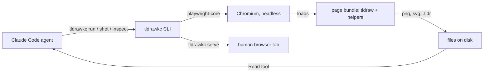

# Prior art and research findings

What already exists, what the tldraw docs actually support, and which facts
shaped the design. Every claim below was checked against a primary source on
2026-09-13. Anything marked *unverified* came from a community project or was
inferred from source rather than documented.

## Facts that shaped the design

| Fact | Consequence | Source |
| --- | --- | --- |
| There is no supported way to run a tldraw `Editor` in plain Node. The editor needs a DOM; tldraw's own tests run it under jsdom via an internal `TestEditor` that is not a public API. | All drawing logic runs inside a real browser page. The Node side only drives the page and moves files around. | [Editor reference](https://tldraw.dev/reference/editor/Editor), [issue #7950](https://github.com/tldraw/tldraw/issues/7950) |
| `@tldraw/store` and `@tldraw/tlschema` are DOM-free and can build records in Node, but you then hand-compute arrow bindings, indices and layout, and still cannot render. | Rejected as the primary path. Kept as a fallback for pure data transforms only. | [store docs](https://tldraw.dev/sdk-features/store), [tlschema DOCS.md](https://github.com/tldraw/tldraw/blob/main/packages/tlschema/DOCS.md) |
| `editor.toImage(ids, { format: 'png', background, pixelRatio, padding })` and `editor.getSvgString(ids, opts)` are the documented export APIs. `exportToBlob` is deprecated. | Screenshots and SVG exports are produced inside the page and handed to Node as base64 or text. | [Image export](https://tldraw.dev/sdk-features/image-export), [PR #5114](https://github.com/tldraw/tldraw/pull/5114) |
| `loadSnapshot(store, { document })` without a `session` key replaces the shapes but keeps camera, selection and current page (since v3.0.0). | The human mirror can poll and reload without yanking the viewer's pan and zoom. | [Persistence](https://tldraw.dev/docs/persistence), [PR #4392](https://github.com/tldraw/tldraw/pull/4392) |
| A `.tldr` file is JSON: `{ tldrawFileFormatVersion: 1, schema, records }`. `parseTldrawJsonFile({ json, schema })` reads one and runs migrations. `serializeTldrawJson(editor)` writes one but needs an `Editor`. | Files are written from inside the page, where an editor exists. Never hand-edit a `.tldr`. | [file.ts source](https://github.com/tldraw/tldraw/blob/main/packages/tldraw/src/lib/utils/tldr/file.ts) |
| No official CDN or script-tag build of tldraw exists. The package ships ESM and CJS only. | The page is a Vite build with React 19 and tldraw bundled, shipped prebuilt in `dist/page`. | [Installation](https://tldraw.dev/installation), [unpkg listing](https://app.unpkg.com/tldraw@4.2.0/files/dist-cjs) |
| tldraw sync (`@tldraw/sync-core`, `TLSocketRoom`) can inject records server-side via `updateStore`, but that method is marked deprecated with no documented replacement, and the demo server wipes rooms after 24 hours. | Not needed for a single agent and one optional viewer. No sync server. | [tldraw sync](https://tldraw.dev/docs/sync), [sync-core API report](https://github.com/tldraw/tldraw/blob/main/packages/sync-core/api-report.api.md) |
| `helpers.mermaid(source)` in the tldraw offline desktop app turns a mermaid flowchart into real bound shapes. tldraw the SDK does not ship this; it is app code. | A mermaid importer has to be written for the page bundle (a small parser over flowchart syntax, mapped to boxes and bound arrows). Scoped as its own roadmap item. | tldraw offline `/readme`, observed during this design session |

## Existing tools

| Project | What it does | Why it is not the answer | Worth borrowing |
| --- | --- | --- | --- |
| [tldraw offline](https://offline.tldraw.com/) desktop app, [repo](https://github.com/tldraw/tldraw-offline) | Electron app with a local HTTP API (`/api/search`, `/api/doc/:id/exec`, `api.getScreenshot`, `helpers.*`, board scripts). Used to draw the ERD that started this work. | A GUI app you must have running. Not scriptable in CI, not open source as a library, and its LAN sharing needs the desktop app on the other end. | The whole shape of its API: `exec` with a live `editor` plus a `helpers` bag, `createArrowBetweenShapes`, `boxShapes`, `getLints`, `mermaid`, screenshot-to-temp-file. [HELPERS.md](HELPERS.md) is modelled on it. |
| [tldraw agent starter kit](https://tldraw.dev/starter-kits/agent), [agent-template](https://github.com/tldraw/agent-template) | Next.js plus Cloudflare Worker. A chat UI where a model streams structured actions that the browser applies to the canvas. | The agent lives inside the web app and talks to a model directly. Our agent is Claude Code in a terminal that wants a CLI and a file. | Its action schema (`AgentActionSchemas.ts`) and "blurry" shape summaries (`FocusedShape.ts`) are a good reference for what `inspect --json` should print. |
| [joelhooks/tldraw-agent](https://github.com/joelhooks/tldraw-agent) | CLI, library and MCP server that turns a text prompt into a diagram via an LLM and exports PNG or SVG. Bun runtime. | It owns the model call. We want the agent already in the loop to draw, look and fix, with no second model. Also no live canvas file to keep iterating on. | Confirms there is demand for exactly this tool shape and that MCP is a common ask. |
| [kitschpatrol/tldraw-cli](https://github.com/kitschpatrol/tldraw-cli) | Community CLI that exports a `.tldr` to PNG or SVG by serving a local tldraw page and driving headless Chrome with Puppeteer. | Export only, no editing, no helpers. | Proof that the "serve a page, drive it headlessly" approach works and stays maintainable. Same mechanism as our `shot` and `export`. |
| jinsoo/tldraw-mcp (*unverified*) | Headless Node MCP server that writes `.tldr` files with `@tldraw/store` directly. | Loses every editor helper; documents that importing the `tldraw` umbrella package in Node hangs. | Its rule "never import `tldraw` at runtime in Node" and its hand-written `.tldr` envelope. |

## Where this tool sits

The agent never sees tldraw's API surface beyond `editor`, `helpers` and the
`tldraw` module inside an `exec` snippet, and never needs the desktop app.

## Things checked and ruled out

- Running the tldraw offline app's API in CI. It is a desktop app with a
  per-launch token; there is no headless mode.
- Replacing tldraw with mermaid rendered through a nicer theme. The complaint
  is layout quality, not colours: mermaid cannot bind arrows to anchors, route
  around boxes, or be nudged after the fact.
- Excalidraw. Similar to tldraw but its programmatic API is thinner, there is
  no binding lint, and no first-party `.excalidraw` to SVG exporter outside
  the browser either. tldraw's editor API is the stronger scripting target.
